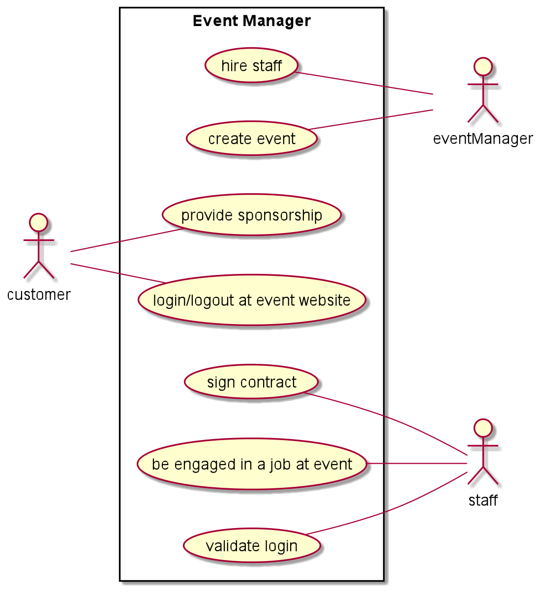

# herzog-cdi-eventmanager project

## Idea

This is an event manager project which covers tasks that
such a manager is in charge of: Planning, organizing, and
executing all types and sizes of events. Customers will
determine the purpose of the event and the budgetary
constraints (financial management).
Duties like hiring staff, reserving locations, arranging
catering services, and setting up other accommodations for
the event will be handled. Compliance with all health and
safety regulations will also be assured.

## What am I implementing?

A Customer, Staff and Event class. The Customer has a username and e-mail variable for his login,
as well as a budget. Staff contains the id and name of the member and Event the
event's title and the id of its manager. The services are being implemented after
the user stories:

* As a Customer, I want a Username and an E-Mail so that I can log in
* As a Staff member, I need to be engaged at the Event so that I have a job
* As a EventManager, I need to hire staff so that I can make sure an adequate amount of people work on the event

## Class Diagram

image::images/cld.png[]

## Use-Case Diagram

